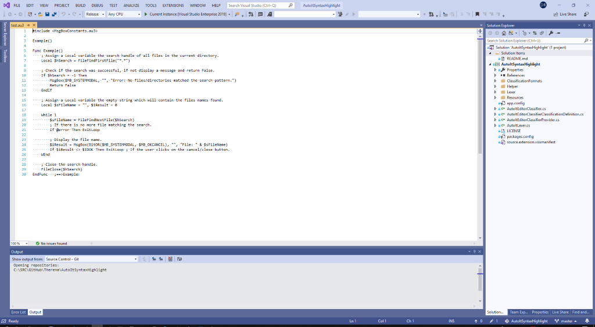
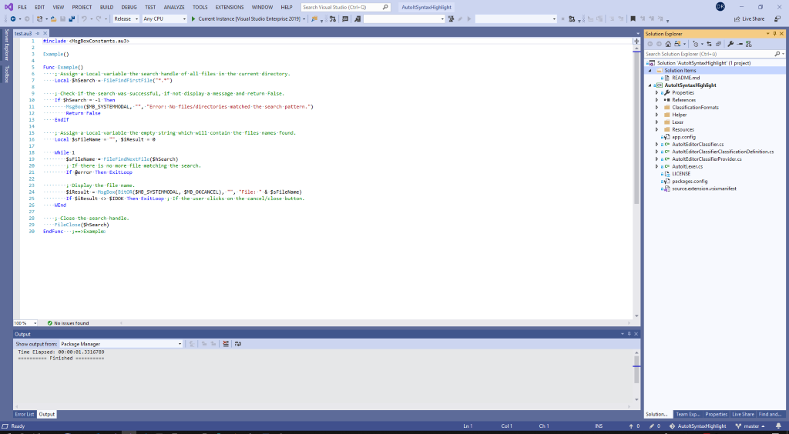

# AutoItSyntaxHighlight

<!-- Update the VS Gallery link after you upload the VSIX-->
Download this extension from the [VS Gallery](https://visualstudiogallery.msdn.microsoft.com/[GuidFromGallery]).

---------------------------------------

AutoIt scripting language support for Visual Studio

See the [changelog](CHANGELOG.md) for changes and roadmap.

## Features

- Systax Highlight for comments, functions, strings, keywords

### Systax Highlight for comments, functions, strings and keywords

Open ".au3" files in Visual Studio **without** this extension:

Open ".au3" files in Visual Studio **with** this extension:

## Contribute
Check out the [contribution guidelines](CONTRIBUTING.md)
if you want to contribute to this project.

## License
[Apache 2.0](LICENSE)